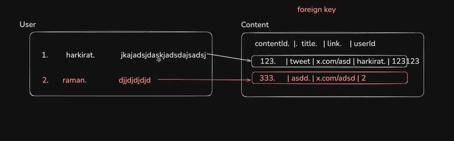
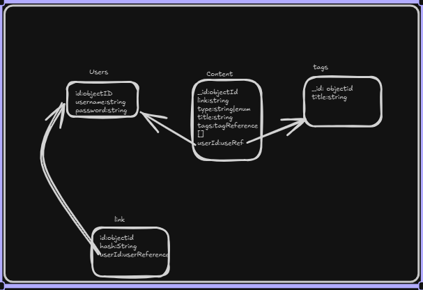

# MyBrain- Second Brain APP

## What we're Building:-

- This is an app where we can save the important links 
- We can share the content in the brain to others.
- We can build a query to search on the all the links.

---

## Frontend

- IT has an generic button which can be used anywhere which has variants
- WE built our own UI library like SHADCDN.
- WE build generic UI for all the component to use multiple time.
- Dashboard, signup, sign in page mainly.
- using useRef hook to handle the input for the signup, sign in.

```tsx
interface ButtonProps {
  text: string;
  variant: "primary" | "secondary";
  size?: "sm" | "md" | "lg";
  startIcon?: ReactElement;
  endIcon?: ReactElement;
  onClick?: () => void;
  fullWidth?:Boolean
}

const varientStyles = {
  primary: "bg-purple-600 text-white ",
  secondary: "bg-purple-200 text-purple-600 hover:bg-purple-400",
};

const defaultStyles = `rounded-md px-4 py-2 font-light flex justify-center items-center gap-2`;
```


----
## Backend

##### 1. Sign Up
- `POST /api/v1/signup`
##### 2. Sign In
- `POST /api/v1/signin`
- returns 
	- 200 
	`'token:'jwt_token'`
	-  403 -wrong email password
	- 500 wrong email password
#####  3.add new content
- `/api/v1/content`

```ts
'type':'document'|'tweet'|'youtube'
"link":"url"
"title":"title of docs/video"
"tags":["productivity","Politics"]
```

##### 4.fetching all existing documentation
- `GET /api/v1/content`
- return all the content of the person
- so we send the JWT to fetch
##### 5.Delete a document 
- `DELETE /api/v1/content`
- Return
	1. 200 : Delete success
	2. 403 trying to delete a doc you don't own
##### 6.Create a shareable link for your second brain
- `POST /api/v1/brain/share`

```ts
{
"share":true
}
```

*This return an hash code which we can use to access the brain of another person*

---
## NOTES:

1. we should install express and dependencies in dev dependencies using
	`npm i -D express`

2. 
	- if we use import express
	- we get this error,

```
Could not find a declaration file for module 'express'. 'd:/Typescript-project/server/node_modules/express/index.js' implicitly has an 'any' type.
```


	*its because there is no `.d.ts` file in express which is its declaration file*
	
	so we use  `npm i -d @types/express`
	
	- //@ts-ignore  //if we add these above any error it goes away
	

3. 
   **TypeScript declaration merging**—specifically, it extends the built-in types of Express.js so your app can safely use a custom property on the request object.

```ts
declare global {
    namespace Express {
        export interface Request {
            userId?: string;
        }
    }
}
```

This tells TypeScript:

> “Whenever I use `Express.Request`, it should also include an optional `userId` property.”

*** 


- SVG stands for scalable vector graphic which doesn't let it pixelate.
- We need to use 
```tsx
 const usernameRef=useRef<HTMLInputElement>(null);
 const username=usernameRef.current?.value;
```

*To tell it what type its expecting in TypeScript*

- Creating a hook of own to fetch data

***ALWAYS USE VITE AT START OF NAME OF ALL THE ENV NAMES IN VITE
SINCE ONLY THE ONCE WITH VITE ARE ALLOWED TO BE USED BY FRONTEND 
ITS VITE SECURITY  SYSTEM

***
## Schema 





1. Users table
2. Content table
3. tags
4. link
5. Share Brain

___
## Architecture

```bash
MyBrain/                   # TypeSCript MERN Learning Project
│
├──  client/               # Frontend (React + Vite + tailwind )
|       ├──  pages 
|       ├──  components 
|       ├──  icons
|       ├──  hooks         # Self created hook for data fetching
|       ├──  .env 
|       └──  app.tsx   
│   
├──  server/               # Backend (Node,Express,MongoDB)
|       ├──  db.ts 
|       ├──  index.ts
|       ├──  middleware.ts
|       ├──  .env
|       └──  utils.ts
|
|
├──  README.md
|
└── .gitignore
```


---
